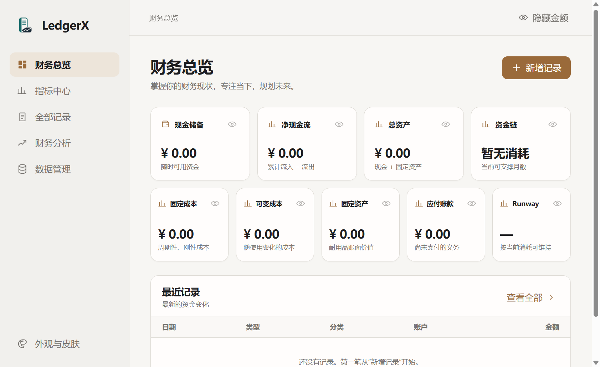

<div align="center">
  
  <h1>LedgerX</h1>
  <p>在本机看清自己的财务状况。钱没有变多，但至少终于知道它去哪了。</p>
</div>

当前版本：v3.1.0

> **当前方向（2026-09-24）**：不再使用 Electron。新版本机网页的记账主流程已用隔离数据验证，可供个人本机使用；尚未制作安装器或分享包。旧版 v3.1 仍是下文介绍的 WPF/React 产品。新版运行方式见 [frontend/README](frontend/README.md)，后续任务按个人实际需求排期，见[任务路线图](docs/tasks/README.md)。

发布说明：[LedgerX v3.1 基础功能迭代构建文档](docs/LedgerX-v3.1-基础功能迭代构建文档.md)

LedgerX 是面向个人的本地财务管理软件。下文 v3.1 功能和构建说明属于已发布旧版；新版功能以当前任务路线图为准。
## v3.1.0 已完成

本次迭代把基础数据链路接通，并针对实际使用中的表单和总览交互做了收敛：

- 新空间提供主流生活、数字服务、资产和负债分类；历史自定义分类保留，新增分类在当前用户空间全局可用。
- 周期成本按日、周、月、年自动计算服务结束日；弹窗滚动锁定背景，日期和按钮在窄屏可用。
- 总览卡片支持鼠标移动/缩放，金额与标题会随卡片宽度换行；固定资产显示原值、累计折旧和当前账面价值。
- 自定义指标可选择归集记录；没有指标时数值记录仍可独立保存。公式数据源支持自定义指标和期间时间变量。
- 新增指标保存后立即进入当前指标列表和总览布局，并在重启后保留；公式会按指标依赖顺序计算并拒绝坏引用或循环。
- “本期摊销成本”按周期记录的服务期间自动计算，不再要求手工归集；固定资产处置支持取消确认和撤销。

## v3.0.0 已完成

这一版把 LedgerX 从“能记账”推进到“能按规则理解财务事实”：

- 指标采用模板库与可视化公式构建器；分类、资金账户和自定义指标可被记录直接选择。
- 固定成本可按服务期按日、周、月、年归属；历史补录可明确设为期初余额、应付款或不影响现金。
- 固定资产支持直线法、工作量法、双倍余额递减法、年数总和法与自定义公式入口。
- 记录、分类、账户和自定义指标支持批量管理；总览卡片支持调整位置、大小并恢复默认。
- 本地用户空间拥有独立账本、分类、账户、指标和布局；第二次启动会激活已打开窗口。
- 金额隐私会覆盖指标、图表、表格、报告、预警和导出视图。

LedgerX 仍是本地优先应用：用户空间不等于云账号，不联网同步、不读取银行卡。



## 为什么做它

很多记账软件以“记了多少笔”为中心，LedgerX 更关心“这些记录说明了什么”。收入、固定成本、可变成本、固定资产、应付账款和 Runway 会被放到同一张仪表盘上——因为账户余额只告诉你今天，而资金链通常已经在偷偷讨论下个月。

## 功能

- **指标优先**：现金储备、净现金流、总资产、资金链、固定成本、可变成本、固定资产、应付账款和 Runway。
- **可配置指标**：模板、结构化公式和直接归集并存；模板只提供参考，不锁死计算口径。
- **自动联动**：一笔现金流入会同步更新现金储备、净现金流和总资产，不必拿计算器进行二次创作。
- **隐私模式**：全部金额或单个指标均可隐藏。适合公共场合，也适合暂时不想面对现实的下午。
- **财务分析**：日报、周报、月报、年报与可视化报表，支持周期比较和下钻。
- **指标详情**：点击指标即可查看构成数据、趋势、公式和来源记录。
- **记录纠错**：记录可编辑，删除后进入回收站，可恢复或永久删除。
- **设置中心**：数据、备份、皮肤、通知和诊断日志统一收纳，首页保持清爽。
- **本地用户空间**：每个空间的数据独立保存；没有在线账号、订阅费和“云端惊喜”。
- **安全备份**：备份包含版本、内容摘要和 SHA-256 完整性校验；恢复前先预览，恢复与清空前自动留一份保护快照。
- **可换肤**：自带暖铜、石墨、深海蓝皮肤，也支持安全的 CSS 变量主题。

## 当前已发布技术栈

- C# / .NET 10（账本、指标计算、本地文件与系统窗口）
- WPF + Microsoft WebView2（轻量原生宿主）
- React + TypeScript + Vite（完整可见界面）
- 本地 JSON 持久化
- 无 Electron、无云端、无在线账号系统

## 目标网页版技术栈

- Vue 3 + Vite + HTML/CSS/JavaScript：新代码位于 `frontend/`，可独立开发和测试。
- 系统浏览器：访问 Java 同源提供的页面，不使用 Electron 或其他桌面壳。
- Java 11：本机模块化单体后端，只绑定 `127.0.0.1`，提供版本化 REST API 和 Vue 静态资源。
- SQLite：每个用户空间一个账本数据库；Java 是唯一写者。
- 一个本机服务入口；不引入云端、微服务或消息系统；首期不考虑 PDF 导出。当前只支持个人本机运行，尚未制作离线分享包。
- 基础版只提供分类、账户、收入、固定支出、弹性支出、余额、编辑和回收站；不加入金融合规、角色、审批、加密或审计体系。

## 下载与运行

以下只适用于已发布的 v3.1 旧版：在仓库的 [Releases](../../releases) 页面下载 `LedgerX.exe`。它是 Windows x64 自包含单文件版本，无需单独安装 .NET；不是新版浏览器交付物。

首次启动后，数据默认保存在：

```text
%LocalAppData%\LedgerX\ledger.json
```

删除程序不会自动删除账本；毕竟软件可以重装，账单不能假装没发生。

## 从源码构建

以下命令只适用于 v3.1 WPF/React 历史发布版本；Vue/Java 基座的验证命令见下方独立小节，不能把两套构建链混用为同一个发布产物。

需要 Windows 10/11、Node.js 20+ 与 .NET 10 SDK。系统需安装 Microsoft Edge WebView2 Runtime（Windows 11 默认已包含）。

~~~powershell
cd web
npm install
npm run build
cd ..
dotnet build native\LedgerX.Native.csproj
dotnet run --project native\LedgerX.Native.csproj
dotnet test native.tests\LedgerX.Tests.csproj -c Release
dotnet publish native\LedgerX.Native.csproj -c Release -o release-native-v3.1
~~~

发布结果位于 `release-native-v3.1\LedgerX.exe`。如需更新桌面快捷方式，可运行 `powershell -ExecutionPolicy Bypass -File native\Create-DesktopShortcut.ps1`。前端 Playwright 回归测试可用 `cd web; npm test` 运行，原生指标、预警、报告和备份单测可用上面的 `dotnet test` 运行。

### Vue/Java 开发回归

开发新版 Vue/Java 本机网页时，在 `frontend/` 安装锁定依赖并运行前端回归：

```powershell
cd frontend
npm ci
npm test
cd ..
.\scripts\build-web.ps1
```

`build-web.ps1` 构建 Vue 页面并执行 Java 测试，产物位于 `target/p7-003/`。需要真实跨层验收时运行 `node frontend/scripts/local-browser-e2e.mjs`，它使用隔离临时账本；旧 Electron 证据见 [S0-006 验证记录](docs/verification/S0-006-electron-rest.md)，仅供历史参考。默认数据根为 `%LOCALAPPDATA%\LedgerX`。网页版可在设置页创建、校验和下载本机备份；备份未加密，请将下载副本另存到可信位置。不要复制运行中的 `ledger.db`。

### 启动本机网页版

在 Windows PowerShell 7 中安装 Java 11+、符合 Vite 要求的 Node.js，并准备依赖后，首次构建并启动本机网页版：

```powershell
cd frontend
npm ci
cd ..
.\scripts\build-web.ps1
.\scripts\start-local.ps1
```

构建脚本把 Vue 页面嵌入 Java JAR，并把运行依赖放在同版本目录；普通启动只运行已有 JAR，不需要 Node 或 Vite。服务只绑定 `127.0.0.1`，终端显示可复制的网址；关闭标签页不会停止服务，按 `Ctrl+C` 退出。运行时需要系统安装 Java 11；当前未制作离线分享包或捆绑 JRE。

运行时真实浏览器验收可单独执行 `node frontend/scripts/local-browser-e2e.mjs`；需先完成构建。该命令会在系统临时目录创建隔离账本，检查同源静态资源、会话/CSRF、初始化、记录创建/编辑/回收/恢复、服务重启和窄屏弹窗可达性，结束后清理隔离账本。

## 自定义皮肤

LedgerX 只读取 CSS 中的 `--lx-*` 主题变量，不执行选择器、脚本或远程资源。可配置背景、表面、侧栏、主色、文字、边框、收入、成本、警告、选中状态、圆角和字体。

示例：

```css
:root {
  --lx-background: #F7F6F3;
  --lx-surface: #FFFDFC;
  --lx-primary: #9A6A3A;
  --lx-text: #1D1D1F;
  --lx-card-radius: 12px;
}
```

## 当前边界

- 仅支持 Windows x64。
- 采用手动记账，不自动读取银行、微信或支付宝数据。
- 不提供云同步或跨设备在线登录；本地用户空间用于逻辑隔离。
- 自定义公式为受限的结构化表达式，不支持任意脚本、网络或文件访问。

## 参与贡献

欢迎提交 Issue 和 Pull Request。修 Bug、补测试、改善无障碍体验都很有价值；如果只是想把按钮改成荧光绿，请先深呼吸十秒。

## License

[MIT](LICENSE)
